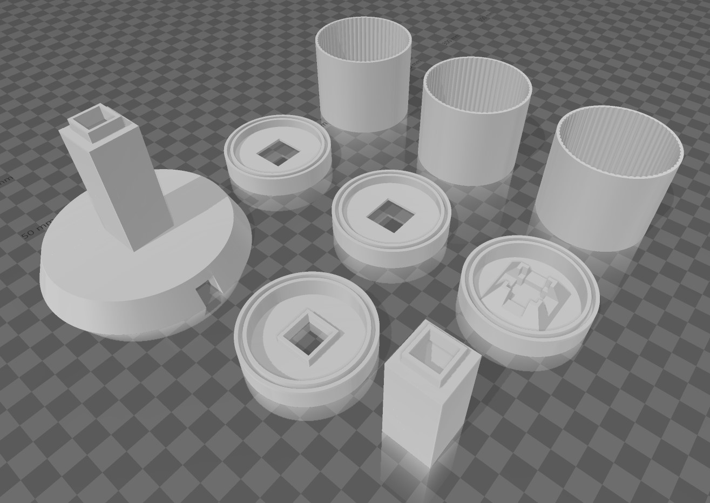

# AndonStack

A physical RGB stack light indicator for radio dispatch consoles, built with an ESP32-C3 and WS2812B NeoPixel LED rings.



## Overview

AndonStack provides visual status indication for radio dispatch operations:

| Light | Condition |
|-------|-----------|
| 🟢 **Green** | Receiving audio on a selected resource |
| 🟡 **Yellow** | Transmitting (voice, alert tones, pages) |
| 🔴 **Red Solid** | Unacknowledged emergency alert |
| 🔴 **Red Pulse** | Priority tone actively transmitting |

Multiple lights can be active simultaneously (e.g., green + yellow when receiving on one resource while transmitting on another).

## Features

### Console Mode
When connected to the [Common Dispatch Console](https://github.com/cooperbran16/Common-Dispatch), the stack light automatically syncs with console activity via USB serial.

### Standalone Mode
When powered without a console connection (or after 30 seconds of no communication), AndonStack enters standalone mode:
- Broadcasts WiFi AP: **SSID:** `AndonStack` | **Password:** `el3c+riC`
- Captive portal web interface for manual light control
- Individual light control (solid/blink/off)
- Chase mode animation

Connecting to the console automatically exits standalone mode.

## Hardware

### Bill of Materials

| Component | Quantity | Link |
|-----------|----------|------|
| ESP32-C3 SuperMini | 1 | [Amazon](https://a.co/d/5IbKtci) |
| WS2812B 16-LED Ring | 3 | [Amazon](https://a.co/d/dpDDAcM) (5-pack) |
| 3D Printed Enclosure | 1 set | See below |
| USB-C Cable | 1 | For power and data |

### 3D Printed Enclosure

This project uses a modified version of the **Modular WS2812 NeoPixel Stack Light** by **giantpune** on Printables.

**Original design:** [Modular WS2812 NeoPixel Stack Light (Andon)](https://www.printables.com/model/700641-modular-ws2812-neopixel-stack-light-andon) by giantpune - Licensed under [CC BY-NC-SA 4.0](https://creativecommons.org/licenses/by-nc-sa/4.0/)

**Modifications made:** Upsized diffuser sections to accommodate the LED ring boards listed above.

Print the following:
- 1x Base
- 1x Bottom cap
- 1x Pole  
- 3x Diffuser sections (white/translucent filament recommended)
- 2x Spacer rings (black filament recommended)
- 1x Top cap

## Wiring

```
ESP32-C3 SuperMini          WS2812B Rings
──────────────────          ─────────────
     5V  ─────────────────── VCC (Ring 1 - Green/Bottom)
    GND  ─────────────────── GND (Ring 1 - Green/Bottom)
  GPIO4  ─────────────────── DIN (Ring 1 - Green/Bottom)
                             DOUT → DIN daisy chain between rings
```

The LED rings have connectors for daisy-chaining. Connect **Data Out** from Ring 1 to **Data In** on Ring 2, and Ring 2's **Data Out** to Ring 3's **Data In**.

### Assembly Notes

- Solder wires to **5V**, **GND**, and **GPIO4** pads on the ESP32-C3
- LED ring boards friction-fit into the diffuser sections
- Hot glue the ESP32-C3 to the underside of the base
- Route USB cable through the base opening

## Firmware

### Requirements

- Arduino IDE 2.x
- ESP32 board support package
- Adafruit NeoPixel library

### Installation

1. **Install ESP32 Board Support:**
   - File → Preferences → Additional Board Manager URLs
   - Add: `https://raw.githubusercontent.com/espressif/arduino-esp32/gh-pages/package_esp32_index.json`
   - Tools → Board → Boards Manager → Search "esp32" → Install

2. **Install Adafruit NeoPixel Library:**
   - Tools → Manage Libraries → Search "Adafruit NeoPixel" → Install

3. **Upload Firmware:**
   - Open `firmware/AndonStack.ino`
   - Select board: Tools → Board → ESP32 Arduino → **ESP32C3 Dev Module**
   - Select your COM port
   - Upload

## Serial Protocol

For developers integrating with other software:

| Direction | Byte(s) | Description |
|-----------|---------|-------------|
| Stack → Host | `0xFF` | Status request (poll) |
| Host → Stack | `0xFE [G] [Y] [R]` | Status response |

Light state values: `0x00` = off, `0x01` = solid, `0x02` = blink

## Integration with Common Dispatch Console

1. Enable "Stack Light" in Settings
2. Click the Stack Light Settings button (gear icon)
3. Click "Connect to Stack Light" and select the ESP32-C3 serial port

The console automatically sends status updates based on radio activity.

## License

- **Firmware:** GPL-3.0
- **3D Models:** [CC BY-NC-SA 4.0](https://creativecommons.org/licenses/by-nc-sa/4.0/) (per original Printables license)

## Credits

- **3D Enclosure Design:** [giantpune](https://www.printables.com/@giantpune) on Printables
- **Firmware & Integration:** Brandon Cooper (KE8VEQ)

## Related Projects

- [Common Dispatch Console](https://github.com/cooperbran16/Common-Dispatch) - Web-based radio dispatch console for KV4P-HT
- [KV4P-HT](https://kv4p.com) - Amateur radio platform
